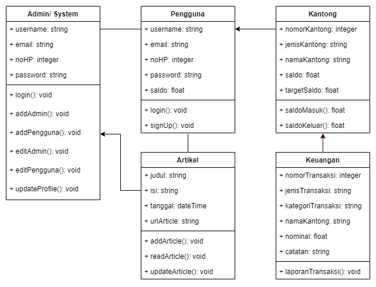
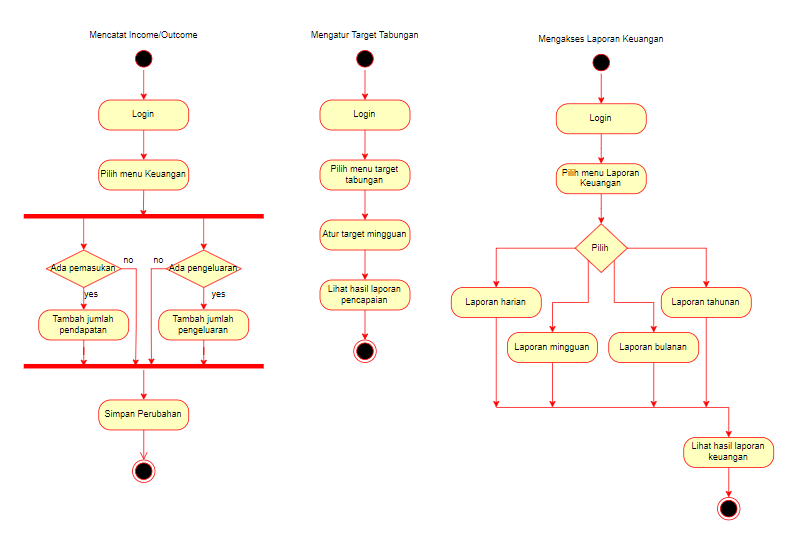

# Wealthify

<h3>Wealthify merupakan aplikasi manajemen keuangan yang memiliki fitur seperti data pemasukan, pengeluaran, target tabungan, <i>financial news</i>, dan laporan keuangan.</h3>

DEVELOPER MAGANG

Ketua Kelompok : Evan Ananda Jati - 20/460543/TK/51132 as Backend Developer 

Anggota 1 : Adya Sena Pamungkas - 20/460536/TK/51125 as Software Architect

Anggota 2 : Laili Rofi'ah - 20/463604/TK/51596 as Front-end Developer 

  
<h3>Diagram<h3>

<h3>Class Diagram</h3>

<h3>Use Case</h3>

<h3>Activity Diagram</h3>

View Github Page : https://evanjat2.github.io/Wealthify/
